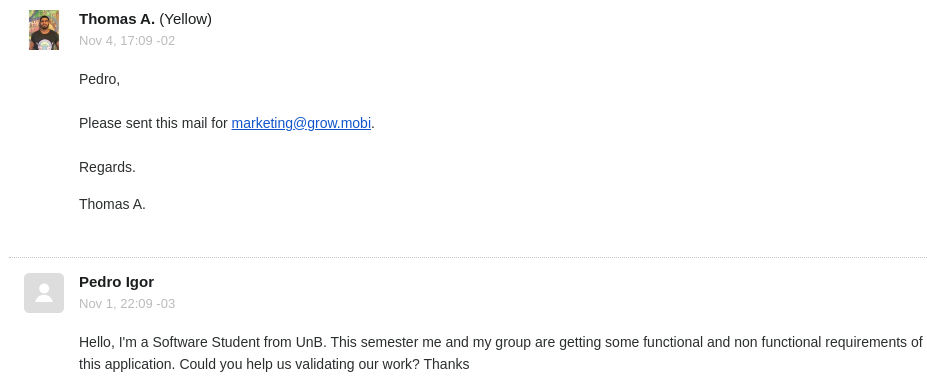
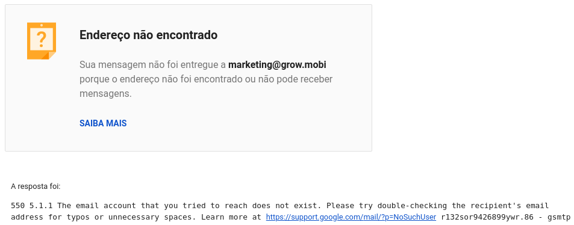

|Versão| Autor | O que fez |  Quando | Onde |
|------|------| --------  |-------- | -----|
|1.0| Pedro Igor | Tentou contato |04/11/2019| Remoto, via Gmail|

# Validação

Entramos em contato com o suporte da Yellow solicitando a validação dos artefatos que elaboramos. Nos responderam em 3 dias informando que deveríamos mandar a solicitação para o email informado. O email foi enviado porém retornou por não encontrar o endereço final ou por não termos permissões para enviar email.

Tentamos adicionar o .com ao final do email informado, o email foi enviado porém até o presente momento não houvera respostas.

## Capturas de tela do contato
**Email recebido:**

**Tentativa de contato com o email solicitado:**

### Referências
Requisitos da aplicação Habitica - <https://requisitos-habitica.netlify.com/VerificacaoRP> Acesso em 05/11/2019 
HOWARD, Andrew Monk. Steve." The Rich Picture: A Tool for Reasoning About Work Context. 
Complexity and Rich Pictures. http://leadershipforchange.org.uk/wp-content/uploads/Complexity-and-rich-pictures.pdf. 
