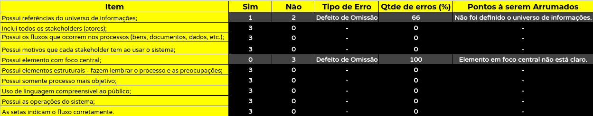
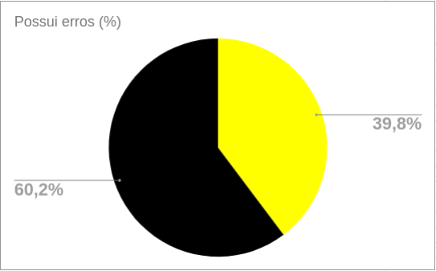

| Nome|O que fez|Quando|
|-----|---------|------|
| Pedro Igor | Criou o documento. | 05/11/2019 |

# Verificação Rich Pictures
## Checklist
Possui referências do universo de informações;
Inclui todos os stakeholders (atores);
Possui os fluxos que ocorrem nos processos (bens, documentos, dados, etc.);
Possui motivos que cada stakeholder tem ao usar o sistema;
Possui elemento com foco central;
Possui elementos estruturais - fazem lembrar o processo e as preocupações;
Possui somente processo mais objetivo;
Uso de linguagem compreensível ao público;
Possui as operações do sistema;
As setas indicam o fluxo corretamente.

## Verificação baseada no checklist

## Possui Erros

## Avaliação geral
Devido a quantidade de rich pictures criados não existem tantas informações nas tabelas assim como para serem inseridas no gráfico. Erros que foram apontados pelo professor nas primeiras apresentações fizeram com que fossem corrigidos com antecedência reduzindo a quantidade de erros na inspeção realizada nesta etapa.