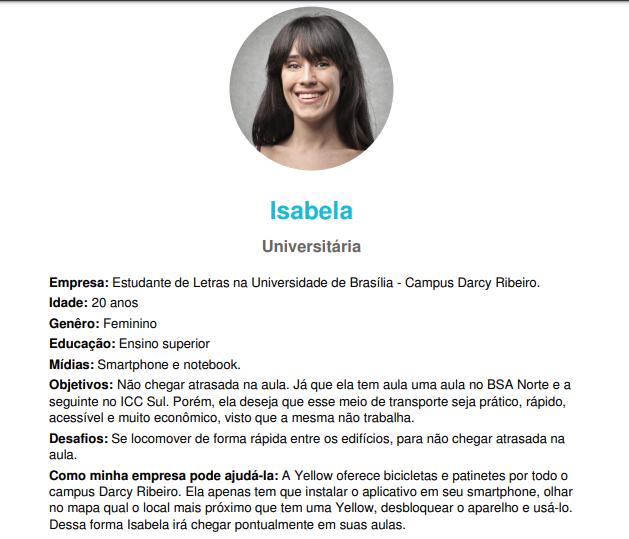

# Personas

##### PARTICIPANTE: Letícia Karla S. R. de Araújo.
##### LOCAL: Remoto, via Gerador de Personas e Google Drive.
##### DATA/HORA: 29 de Setembro de 2019 - 20h.

## Propósito
#### Persona é a representação fictícia do seu cliente ideal. Ela é baseada em dados reais sobre comportamento e características demográficas dos seus clientes. Apresenta, também, uma criação de suas histórias pessoais, motivações, objetivos, desafios e preocupações. 

## Objetivos
#### Utilizando dos resultados das técnicas de entrevista e questionário foi possível estabelecer contato com os usuários da Yellow e propôr 3 personas.

## Resultados
### Persona 1 
#### A Isabela foi criada tendo em vista os resultados das entrevistas e questionário aplicados no campus Darcy Ribeiro. O qual tem a maioria dos usuário da Yellow como estudantes universitários, na faixa de 17 à 30 anos de idade e usam a Yellow para se locomover no campus.

### Persona 2
#### O Henrique foi criado tendo em vista os resultados das entrevistas e questionário aplicados na Rodoviária do Plano Piloto. O qual tem a maioria dos usuário da Yellow como funcionários públicos ou estagiários de órgãos públicos, na faixa de 21 à 50 anos de idade e usam a Yellow para se locomover da rodoviária para as instituições presentes na Esplanada dos Ministérios.

### Persona 3
#### O Rafael foi criado tendo em vista os resultados das entrevistas e questionário aplicados na Avenida das Araucárias  em Águas Claras. O qual tem a maioria dos usuário da Yellow como pessoas interessadas em andar de bicicleta no Parque de Águas Claras ou de se locomover pelo bairro sem a necessidade de carro ou moto.  E estão na faixa de 15 à 50 anos de idade.

## Conclusão
#### A técnica de elaborar personas auxiliou na compreensão do por que elaborar outras técnicas, tais como entrevista, questionário e brainstorm e, também de como poderiam essas personas serem inseridas em técnicas e storyboard como storytelling. Além disso, proporcionar a melhor compreensão de como seria o usuário da Yellow em três ambientes diferentes, dentro da cidade.