# Questionário

#### PARTICIPANTE: Letícia Karla S. R. de Araújo.
#### LOCAL: Remoto, via Google Forms.
#### DATA/HORA: 24 de Setembro de 2019 à 29 de Setembro de 2019.

#### A técnica de questionário teve como enfoque coletar dados, via formulário online, dos usuários de forma que auxiliasse traçar estrategicamente objetivos para levantar requisitos funcionais e não funcionais do aplicativo Yellow. 

### Usuário da Yellow?
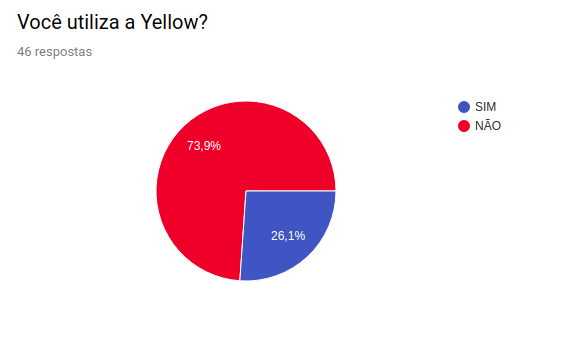
### Sexo
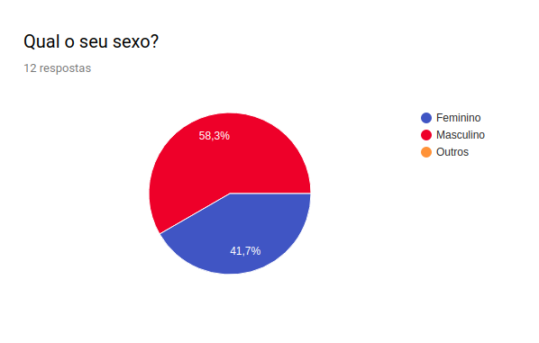
### Idade
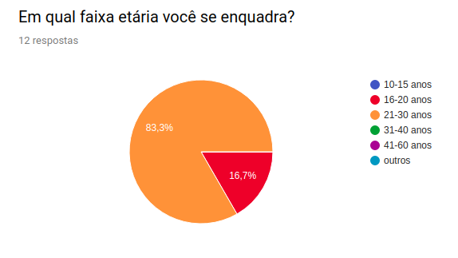
### Meio de transporte utilizado
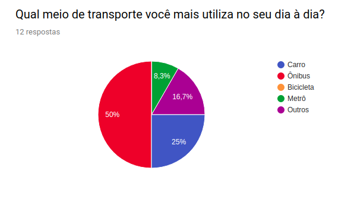
### Dificuldade de utilizar
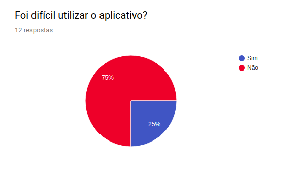
### Instruções
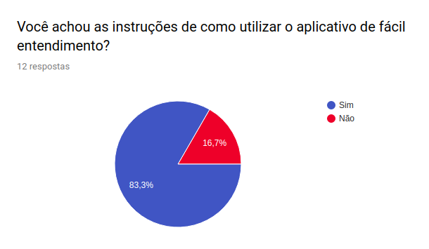
### Opiniões sobre a opção de Compartilhar Crédito
* "Excelente".
* "Nem sabia que existia".
* "Eu nem sabia, mas já achei um arraso".
* "Ainda nao utilizei, mas gostei muito da ideia".
* "Útil".
* "Bom".
* "Importante".
* "Achei interessante".
* "Boa".
* "Bem interessante".

### Opiniões sobre a opção de pagar boletos bancários
* "Boa".
* "Muito boa". 
* "Nunca usei".
* "Tendência".
* "Muito útil".
* "Bom pra quem não term cartão, mas o crédito demora para aparecer".
* "Desnecessário".
* "Maravilhosa".
* "Ainda não usei".

### Já enfretou problemas no aplicativo?
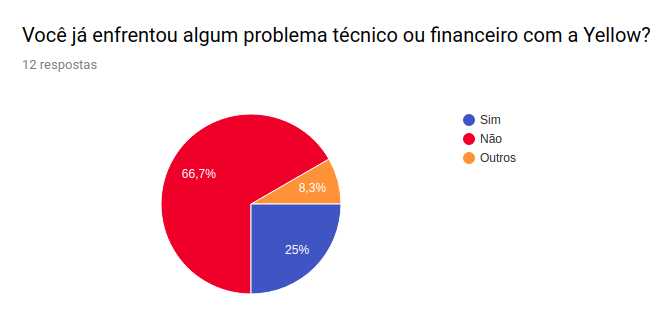

### Tipos de problema Financeiro 
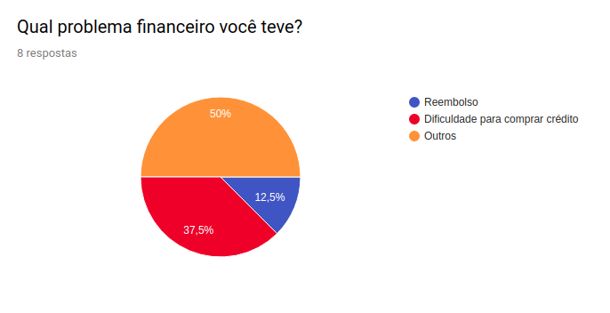

### Ajuda
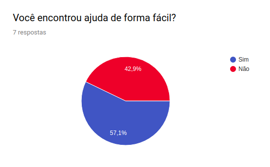

### Tipos de problemas técnicos
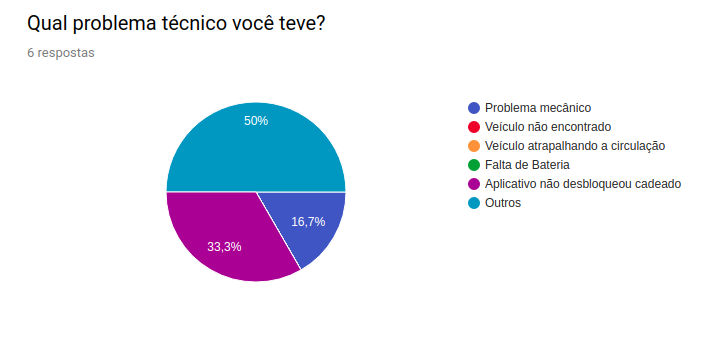

### Motivo da não utilização
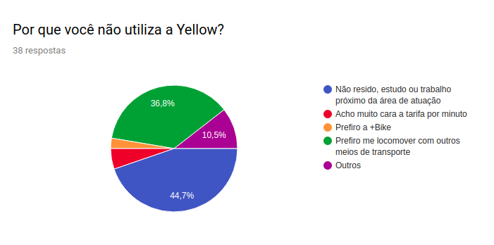

### Conclusão

#### Com o uso desta técnica em conjunto com outras técnicas de elicitação, o grupo pode realizar uma análise sobre quais os requisitos funcionais e não funcionais seriam convenientes de serem levantados. Os quais o funcionais mais afetados pela técnica são:
* RF001 (O sistema deve permitir o cadastro de novos usuários); 
* RF003 (O sistema tem que ser capaz de recarregar créditos para a utilização dos veículos);
* RF004 (O sistema tem que mostrar a localização dos veículos disponíveis);
* RF005 (O usuário tem que ser capaz de desbloquear um veículo (público));
* RF007 (O sistema poderia permitir compartilhamento de crédito); 
* RF009 (A aplicação deveria ter integração com bancos digitais de forma que facilite a inserção de crédito). 

#### Já os não funcionais mais afetados pela técnica são:
* RNF001 (A aplicação deve ser prática e simples de utilizar);
* RNF005 (O custo para aluguel de um meio de transporte deve ser baixo);
* RNF006 (A aplicação deve abranger a maior área urbana possível);
* RNF008 (Os avisos sobre os gastos devem ser feitos de forma prévia, de forma que o usuário possa parar de utilizar antes de ser cobrado uma quantia indevida).