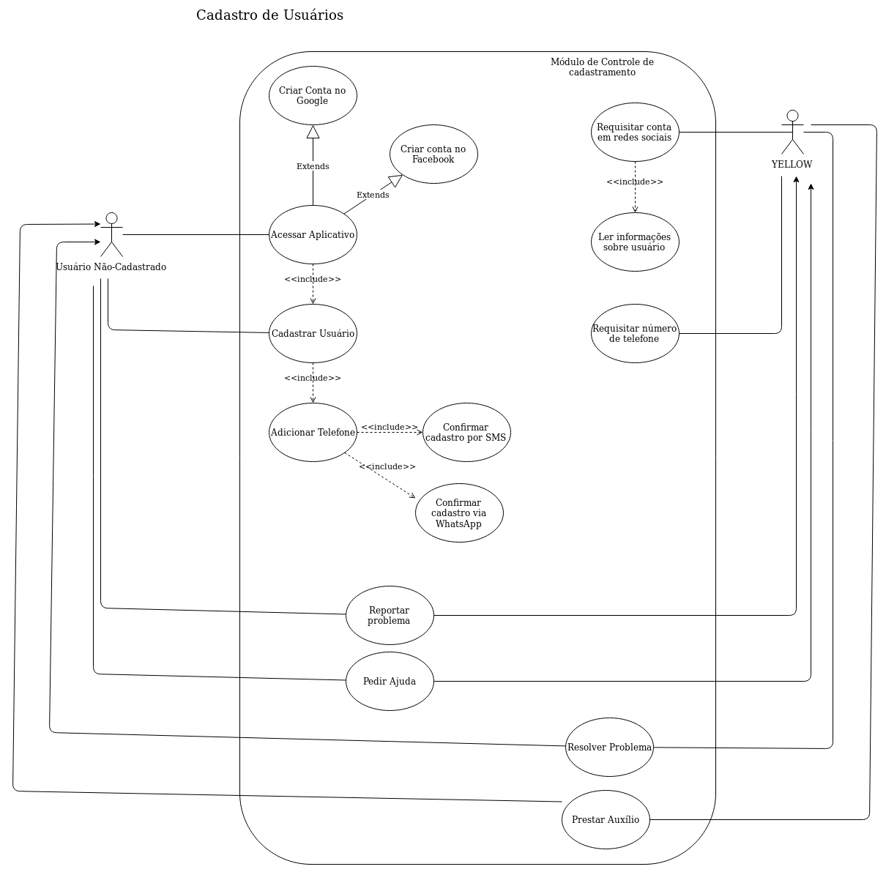
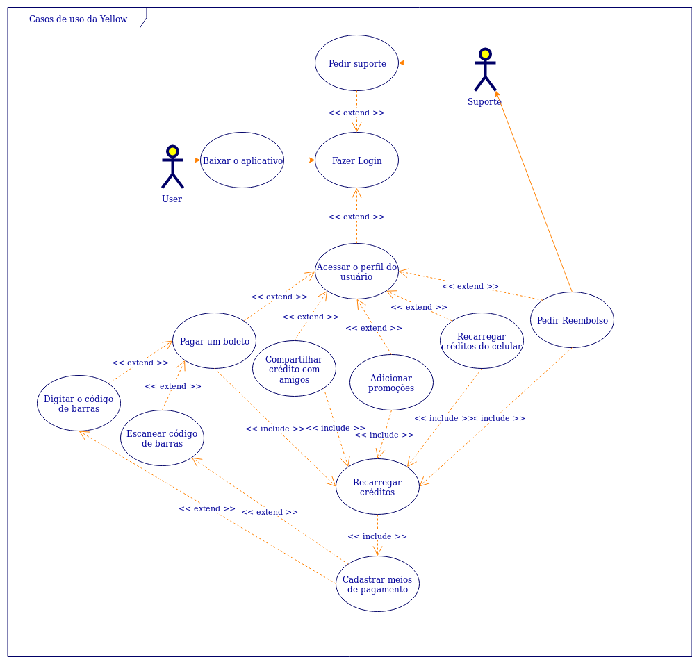

|Versão| Autor | O que fez |  Quando | Onde |
|------|------| --------  |-------- | -----|
|2.0| Letícia Karla e Dâmaso Júnio | Criou o documento. |25/10/2019| Remoto, via Draw.io|
|2.1| Letícia Karla e Dâmaso Júnio | Adicionou descrição sobre cada cada de uso |21/11/2019| Remoto|

# Casos de Uso

## 1. Sumário
1. Sumário
2. Introdução
3. Metodologia
4. Casos de Uso
5. Resultados
6. Conclusão
7. Referências

## 2. Introdução

O diagrama documenta o que o aplicativo faz do ponto de vista do usuário. Em outras palavras, ele descreve as principais funcionalidades do sistema e a interação dessas funcionalidades com os usuários da Yellow. 
Em sua segunda versão, o diagrama foi dividido. E atualizado, de acordo com os feedbacks do professor e dos monitores em relação a como as tarefas deveriam ser mais detalhadas e especificadas possível. 

## 3. Metodologia

Um Caso de Uso define uma sequencia de ações executadas pelo sistema retornando valores que podem ser observados pelos Atores. Um Ator é um papel que um usuário desempenha em relação ao sistema. Cada Caso de Uso descreve ações que o sistema deve executar para retornar algum valor para o Ator,   demostra as funcionalidades do sistema utilizadas pelos Atores. O Caso de Uso representa um fluxo completo de eventos, diálogo entre os Atores e o sistema.

## 4. Casos de Uso

 

## 5. Resultados

### UC01 - Baixar o aplicativo

|Descrição|Fazer o download do aplicativo pela loja do sistema|
|---------|-|
|**Atores**|Usuário|
|**Pré-Condições**|Ter um smartphone Android e/ou iOS|
|**Linha de eventos**|Evento 01: Entrar na loja -> Baixar o aplicativo   Evento 02: Entrar na loja -> Procurar pelo aplicativo|
|**Fluxo principal**|**FP01 - Fazer o download do aplicativo:**  Esse fluxo tem como finalidade fazer o download do aplicativo Yellow   1. O Ator entra na loja de aplicativos.   2. O Ator procura pelo aplicativo na loja.   3. O Ator realiza o download.|
|**Fluxos Alternativos**| -- |
|**Fluxos de exceções**|--|
|**Pós-condições**|O ator terá o aplicativo baixado em seu smartphone|

### UC02 - Fazer login

|Descrição|Efetuar o login no aplicativo|
|---------|-|
|**Atores**|Usuário|
|**Pré-Condições**|Ter o aplicativo instalado no smartphone Android e/ou iOS|
|**Linha de eventos**|Evento 01: Entrar no aplicativo -> Efetuar o login com Facebook   Evento 02: Entrar no aplicativo -> Efetuar o login com o Google|
|**Fluxo principal**|**FP01 - Fazer o login no aplicativo com o Facebook:**  1. O Ator entra no aplicativo.   2. O Ator clica em "Login com Facebook".   3. O Ator acessa sua conta.|
|**Fluxos Alternativos**|**FA01 - Fazer o login no aplicativo com o Google:** 1. O Ator entra no aplicativo.   2. O Ator clica em "Login com o Google".   3. O Ator acessa sua conta.|
|**Fluxos de exceções**|**FE01 - O usuário não tem cadastro com o Facebook:** 1. O Ator não tem conta no Facebook 2. O Ator clica em "Login com Facebook". 3. O Ator não acessa sua conta  **FE02 - O usuário não tem cadastro com o Google** 1. O Ator não tem conta no Google. 2. O Ator clica em "Login com Google". 3. O Ator não acessa sua conta.|
|**Pós-condições**|O usuário deve ter acesso às funcionalidades do aplicativo.|

### UC03 - Pedir Suporte

|Descrição|Solicitar suporte do aplicativo para resolver um problema|
|---------|-|
|**Atores**|Usuário|
|**Pré-Condições**|Ter o aplicativo instalado no smartphone Android e/ou iOS  Ter efetuado o login no aplicativo|
|**Linha de eventos**|Evento 01: Bicicleta não destrava -> Pedir suporte Evento 02: Patinete não destrava -> Pedir suporte Evento 03: Bicicleta não trava após o uso -> Pedir suporte  Evento 04: Patinete não trava após o uso -> Pedir suporte Evento 05: Não é possível adicionar crédito na conta -> Pedir suporte Evento 06: Pedir reembolso -> Pedir suporte Evento 07: Veículo está danificado -> Pedir suporte Evento 08: Algum problema surge -> Pedir suporte|
|**Fluxo principal**|**FP01 - O usuário solicita o suporte do aplicativo:**  1. O Ator está utilizando o aplicativo.   2. Surge um problema no uso do aplicativo e/ou dos veículos   3. O Ator acessa a área de suporte ao usuário.|
|**Fluxos Alternativos**|--|
|**Fluxos de exceções**|**FE01 - O suporte não está disponível:** 1. O Ator está utilizando o aplicativo.   2. Surge um problema no uso do aplicativo e/ou dos veículos. 3. O suporte não está disponível.|
|**Pós-condições**|O usuário recebe o suporte corretamente, para solucionar o seu problema.|

### UC04 - Acessar o perfil do usuário

|Descrição|Acessar o perfil do usuário|
|---------|-|
|**Atores**|Usuário|
|**Pré-Condições**|Ter uma conta no aplicativo|
|**Linha de eventos**|Evento 01: Abrir o aplicativo -> Clicar no ícone do perfil|
|**Fluxo principal**|**FP01 - O usuário acessa o próprio perfil** 1. O Ator entra no aplicativo.  2. O Ator clica no ícone do perfil do usuário   3. O Ator acessa o próprio perfil.|
|**Fluxos Alternativos**|--|
|**Fluxos de exceções**|**FE01 - O usuário não tem cadastro no aplicativo**  1. O Ator entra no aplicativo   2. O Ator não tem cadastro no aplicativo.|
|**Pós-condições**|O usuário consegue ter acesso às opções variadas na sua página de perfil.|

### UC05 - Pagar um boleto

|Descrição|Realizar o pagamento de um boleto bancário|
|---------|-|
|**Atores**|Usuário, Sistema|
|**Pré-Condições**|Ter o aplicativo instalado no smartphone Android e/ou iOS Ter um cartão de crédito  Ter créditos no aplicativo|
|**Linha de eventos**|Evento 01: Abrir o aplicativo -> Clicar em "Carteira" -> Pagar um boleto. Evento 02: Abrir o aplicativo -> Clicar em "Perfil" -> Clicar em "Carteira" -> Pagar um boleto.|
|**Fluxo principal**|**FP01 - Clicar em "Carteira"** 1. O Ator entra no aplicativo 2. O Ator clica no ícone da "Carteira" ao canto da tela 3. O Ator clica em "Pagar um boleto".|
|**Fluxos Alternativos**|**FA01 - Clicar em "Perfil"** 1. O Ator abre o aplicativo. 2. O Ator clica no ícone de "Perfil". 3. O Ator clica na opção "Carteira". 4. O Ator clica em "Pagar boleto".|
|**Fluxos de exceções**|**FE01 - O usuário não tem cartão de crédito** 1. O Ator clica em "Pagar boleto". 2. O Sistema pede para que seja feito o cadastro de um cartão de crédito. **FE02 - O usuário não tem créditos no aplicativo** 1. O Ator clica em "Pagar boleto". 2. O Sistema informa que o usuário não tem créditos disponível.|
|**Pós-condições**|O usuário realiza o pagamento de um boleto bancário com sucesso.|

### UC06 - Compartilhar crédito com os amigos

|Descrição|Realizar o compartilhamento de crédito entre os usuários|
|---------|-|
|**Atores**|Usuário e Sistema|
|**Pré-Condições**|Duas pessoas diferentes, tenham o cadastro no aplicativo. Uma das pessoas deve ter créditos no aplicativo.|
|**Linha de eventos**|Evento 01: Abrir o aplicativo -> Clicar em "Perfil" -> Clicar em "Carteira" -> Compartilhar créditos. Evento 02: Abrir o aplicativo -> Clicar em "Carteira" -> Compartilhar créditos.|
|**Fluxo principal**|**FP01 - Clicar em "Carteira"** 1. O Ator abre o aplicativo. 2. O Ator clica em "Carteira". 3. O Ator clica em "Compartilhar crédito com amigos".  4. É feito o compartilhamento.|
|**Fluxos Alternativos**|**FA01 - Clicar em "Perfil"** 1. O Ator abre o aplicativo. 2. O Ator clica em "Perfil". 3. O Ator clica em "Carteira". 4. O Ator clica em "Compartilhar crédito com amigos". 5. É feito o compartilhamento.|
|**Fluxos de exceções**|**FE01 - Usuário não tem crédito** 1. O Ator clica em "Compartilhar crédito com amigos". 2. O Sistema informa que o usuário não tem créditos disponíveis. 3. O compartilhamento não é feito|
|**Pós-condições**|O segundo usuário recebe os créditos compartilhados para que ele possa utilizar no aplicativo.|

### UC07 - Adicionar promoções

|Descrição| Adicionar promoções para o usuário utilizar|
|---------|-|
|**Atores**| Sistema e usuário.|
|**Pré-Condições**|A empresa desenvolver promoções para os usuários do aplicativo.   As promoções devem estar visíveis para o usuário.|
|**Linha de eventos**|Evento 01: Os desenvolvedores deixam a promoção disponível na tela inicial. -> O usuário clica na promoção. -> O usuário utiliza a promoção.   Evento 02: A empresa disponibiliza códigos promocionais -> O usuário escreve o código quando for pagar os créditos. |
|**Fluxo principal**|**FP01 - Clicar na Promoção**   1.  O Ator abre o aplicativo.   2. O ator clica na "Promoção".   3. O ator utiliza a promoção.   **FP02 - Utilizar código promocional**   1. O sistema gera o "Código Promocional".   2. O ator clica em "Carteira".   3. O usuário adiciona o crédito.   4. O usuário insere o código promocional.  |
|**Fluxos Alternativos**|N/A.|
|**Fluxos de exceções**|**FE01 - O usuário não tem direito a código Promocional**   1. O usuário adiciona o crédito   2. O usuário tenta colocar o código promocional.   3. O sistema informa ao usuário que ele não tem direito à código promocional.|
|**Pós-condições**|O usuário paga mais barato pelos créditos, ou recebe promoções que facilitem o uso do produto oferecido pelo aplicativo.|

### UC08 - Recarregar créditos do celular

|Descrição|Inserir créditos no celular utilizando crédito da Yellow|
|---------|-|
|**Atores**|Usuário e Sistema.|
|**Pré-Condições**|O usuário ter créditos no aplicativo e chip de celular, que possua sistema de recarga de crédito.|
|**Linha de eventos**|Evento 01: O sistema estabelece conexão com as operadoras de telefonia -> O sistema disponibiliza as operadoras para o usuário.   Evento 02: O usuário escolhe a quantidade de crédito que irá recarregar o celular -> o sistema disponibiliza campos para adicionar o número telefônico.|
|**Fluxo principal**|**FP01 - Inserir crédito**   1. O ator abre o aplicativo.   2. O ator clica em "Carteira".   3. O usuário clica em "Recarga de Celular".   4. O ator clica na "Operadora de Telefonia".   5. O usuário insere o número telefônico.   6. O usuário confirma a operação.|
|**Fluxos Alternativos**|**FA01 - Clicar em "Perfil"** 1. O Ator abre o aplicativo. 2. O Ator clica em "Perfil". 3. O Ator clica em "Carteira".  4. O usuário clica em "Recarga de Celular".   5. O ator clica na "Operadora de Telefonia".   6. O usuário insere o número telefônico.   7. O usuário confirma a operação.|
|**Fluxos de exceções**|**FE01 - Usuário não tem crédito** 1. O Ator clica em "Recarregar Celular". 2. O Sistema informa que o usuário não tem créditos disponíveis. 3. A recarga não é realizada.|
|**Pós-condições**|O usuário tem créditos no celular para utilizar da forma que prefirir.|

### UC09 - Pedir reembolso

|Descrição|Realizar reembolso ao usuário|
|---------|-|
|**Atores**|Usuário e Sistema.|
|**Pré-Condições**|O sistema deve ter realizado uma cobrança indevida ao usuário.|
|**Linha de eventos**|Evento 01: O usuário verifica que houve uma cobrança indevida -> O usuário contata o aplicativo.   Evento 02: O aplcativo analisa o pedido de reembolso do usuário -> O aplicativo informa ao usuário a ação decidida.|
|**Fluxo principal**|**FP01 - Pedir reembolso**   1. O ator abre o aplicativo.  2. O ator clica em "Carteira".  3. O ator clica em "Estornar Crédito".|
|**Fluxos Alternativos**|**FA01 - Clicar em "Perfil"** 1. O Ator abre o aplicativo. 2. O Ator clica em "Perfil". 3. O Ator clica em "Carteira". 4. O ator clica em "Estornar Crédito".|
|**Fluxos de exceções**|**FE01 - O usuário não realizou compra de crédito** 1. O usuário clica em "Estornar Crédito" 2. O sistema informa ao usuário que ele não utilizou crédito|
|**Pós-condições**|O usuário soluciona seus problemas de cobranças indevidas.|

### UC10 - Digitar o código de barras

|Descrição|Permitir a digitação do código de barras |
|---------|-|
|**Atores**|Usuário e Sistema.|
|**Pré-Condições**|O usuário deve conter um código de barras válido para serlido pelo sistema, com o intuito de pagar boletos. |
|**Linha de eventos**|Evento 01: O usuário tem um boleto para pagar -> O usuário quer digitar o código de barras.|
|**Fluxo principal**|**FP01 - Pagar Contas**   1. O ator abre o aplicativo.   2. O ator clica em "Pagar Conta".   3. O ator clica em "Digitar Código".|
|**Fluxos Alternativos**|N/A.|
|**Fluxos de exceções**|**FE01 - O usuário não tem crédito** 1. O usuário clica em "Pagar Conta". 2. O sistema informa ao usuário que ele não tem créditos.|
|**Pós-condições**|O usuário consegue utilizar os seus créditos da Yellow para pagar suas contas.|

### UC11 - Escanear o código de barras

|Descrição|Permitir o escaneio do código de barras |
|---------|-|
|**Atores**|Usuário e Sistema.|
|**Pré-Condições**|O usuário deve conter um código de barras válido para ser lido pelo sistema, com o intuito de pagar boletos. |
|**Linha de eventos**|Evento 01: O usuário tem um boleto para pagar -> O usuário quer escanear o código de barras.|
|**Fluxo principal**|**FP01 - Pagar Contas**   1. O ator abre o aplicativo.   2. O ator clica em "Pagar Conta".   3. O ator escanea o código de barras pela câmera do smartphone.|
|**Fluxos Alternativos**|N/A.|
|**Fluxos de exceções**|**FE01 - O usuário não tem crédito** 1. O usuário clica em "Pagar Conta". 2. O sistema informa ao usuário que ele não tem créditos.|
|**Pós-condições**|O usuário consegue utilizar os seus créditos da Yellow para pagar suas contas.|
### UC12 - Recarregar créditos

|Descrição|Realizar a adição de créditos ao sistema.|
|---------|-|
|**Atores**|Usuário e Sistema|
|**Pré-Condições**|O usuário deve conter uma forma de pagamento aceita pelo sistema.|
|**Linha de eventos**|Evento 01: O usuário deseja recarregar o aplicativo -> O sistema disponibiliza formas de pagamentos para o usuário.|
|**Fluxo principal**|**FP01 - Recarregar Sistema Virtualemente**   1. O ator abre o aplicativo. 2. O ator clica em "Carteira". 3. O ator seleciona uma forma de pagamento. 4. O sistema recebe o pagamento.   5. O sistema adiciona os créditos à conta do usuário. **FP02 - Recarregar Sistema em Pontos de recarga**   1. O ator dirigi-se à um ponto físico de venda. 2. O ator adquire o cartão de crédito da yellow, com uma valor pre-definido. 3. O ator abre o aplicativo. 4. O ator clica em "Carteira".   5. O ator clica em "Adicionar Código". 6. O ator insere o código do cartão físico. 7. O sistema confere a veracidade do código.  8. O sistema adiciona os créditos à conta do ator.|
|**Fluxos Alternativos**|**FA01 - Adicionar créditos"** 1. O Ator abre o aplicativo. 2. O Ator clica em "Perfil". 3. O Ator clica em "Carteira".  4. O ator seleciona uma forma de pagamento. 5. O sistema recebe o pagamento.   6. O sistema adiciona os créditos à conta do usuário.|
|**Fluxos de exceções**|N/A.|
|**Pós-condições**|O usuário tem adicionados à sua conta os créditos desejados.|

### UC13 - Cadastrar meios de pagamentos

|Descrição|Cadastrar novos meios de pagamento no aplicativo|
|---------|-|
|**Atores**|Usuário|
|**Pré-Condições**|Ter cadastro no aplicativo|
|**Linha de eventos**|Evento 01: Perfil -> Carteira -> Cadastrar cartão de crédito Evento 02: Carteira -> Cadastrar cartão de crédito|
|**Fluxo principal**|**FP01 - Carteira** 1. O Ator entra no aplicativo. 2. O Ator clica em "Carteira". 3. O Ator clica em "Cadastrar cartão de crédito".|
|**Fluxos Alternativos**|**FA01 - Perfil"** 1. O Ator entra no aplicativo. 2. O Ator clica em perfil. 3. O Ator clica em "Carteira". 4. O Ator clica em "Cadastrar cartão de crédito". |
|**Fluxos de exceções**|**FE01 - O usuário não tem cartão válido**  1. O Ator entra no aplicativo. 2. O Ator clica em perfil. 3. O Ator clica em "Carteira". 4. O Ator clica em "Cadastrar cartão de crédito".  5. O cartão não é válido.|
|**Pós-condições**|O usuário tem o cartão cadastrado para uso no aplicativo.|

### UC14 - Criar uma conta com o Google

|Descrição|Se cadastrar utilizando uma conta do Google|
|---------|-|
|**Atores**|Usuário|
|**Pré-Condições**|Ter uma conta cadastrada no Google.|
|**Linha de eventos**|Evento 01: Entrar no aplicativo -> Clicar em "Entrar com Google".|
|**Fluxo principal**|**FP01 - Cadastrar com conta Google** 1. O ator entra no aplicativo 2. O ator clica em "Entrar com Google" 3. O usuário faz o Login.|
|**Fluxos Alternativos**|N/A|
|**Fluxos de exceções**|N/A|
|**Pós-condições**|O usuário faz o cadastro com a Conta do Google.|

### UC15 - Acessar o aplicativo

|Descrição|Permitir o acesso ao aplicativo|
|---------|-|
|**Atores**|Usuário e Sistema|
|**Pré-Condições**|O usuário deve ter cadastro no sistema e ter o aplicativo baixado em seu dispositivo móvel.|
|**Linha de eventos**|Evento 01: O usuário deseja acessar o aplicativo -> O usuário coloca sua forma de acesso. -> O sistema verifica se as informações fornecidas pelo usuário existem no banco de dados do aplicativo. -> O sistema devolve a resposta ao usuário sobre o seu acesso.|
|**Fluxo principal**|**FP01 - Entrar no aplicativo** 1. O ator fornece suas informações de acesso.   2. O sistema verificar se as informações estão corretas e se elas existem no banco de dados do aplicativo. 3. O sistema permite o acesso do ator ao sistema.|
|**Fluxos Alternativos**|N/A.|
|**Fluxos de exceções**|**FE01 - O usuário não é cadastrado**  1. O ator fornece suas informações de acesso.   2. O sistema verificar se as informações estão corretas e se elas existem no banco de dados do aplicativo. 3. O sistema informa ao usuário que as informações não existem no sistema e oferece a opção de cadastro do usuário.|
|**Pós-condições**|O usuário tem acesso ao aplicativo e todas as suas funcionalidades.|

### UC16 - Cadastrar o usuário

|Descrição|Realizar cadastro do usuário|
|---------|-|
|**Atores**|Usuário e Sistema|
|**Pré-Condições**|O usuário conter todas as informaçõe necessárias para o cadastro.|
|**Linha de eventos**|Evento 01: O usuário deseja cadsatrar-se no sistema. -> O sistema disponibiliza formas de cadastramento.|
|**Fluxo principal**|**FP01 - Cadastrar Usuário**  1. O usuário baixa o aplicativo.   2. O sistema disponibiliza formas de cadastramento para o usuário. 3. O usuário escolhe uma forma de cadastramento.  4. O sistema confere as infromações fornecidas no cadastramento e insere o usuário em seu banco de dados.|
|**Fluxos Alternativos**|N/A.|
|**Fluxos de exceções**|**FE01 - O usuário não contem informações necessárias** 1. O usuário coloca suas informações.  2. O sistema afere as informações.   3. O sistema verifica incertezas ou omissões de informações.  4. O sistema notifica o usuário e não realiza o seu cadastramento.|
|**Pós-condições**|O usuário tem seu cadastro realizado e pode acessar o sistema.|

### UC17 - Adicionar telefone

|Descrição|Realizar o cadastramento de telefone do usuário|
|---------|-|
|**Atores**|Usuário e Sistema.|
|**Pré-Condições**|O usuário deve conter um numéro de telefone válido.|
|**Linha de eventos**|Evento 01: O usuário deseja inserir no sistema seu número de telefone. -> O sistema deve aferir a veracidade do número telefônico.|
|**Fluxo principal**|**FP01 - Inserir telefone**  1. O ator irá abrir o aplicativo. 2. O ator clica em "Perfil". 3. O ator clica em "Informações Pessoais". 4. O ator clica em "Editar". 5. O ator edita ou adiciona o número telefônico. 6. O ator clica em "Salvar".|
|**Fluxos Alternativos**|N/A.|
|**Fluxos de exceções**|N/A.|
|**Pós-condições**|O usuário tem o seu telefone adicionado ao perfil no aplicativo.|

### UC18 - Criar conta com o Facebook

|Descrição|Realizar o cadsatro via Facebook|
|---------|-|
|**Atores**|Usuário e Sistema.|
|**Pré-Condições**|o usuário deve conter uma conta ativa na rede social, Facebook.|
|**Linha de eventos**|Evento 01: O usuário quer se cadastrar com o Facebook -> O aplicativo deve obetr as informações para o cadastro pela rede social.|
|**Fluxo principal**|**FP01 - Cadastrar**  1. O ator entra no aplicativo. 2. O ator clica em "Cadastrar". 3. O ator escolhe a opção "Cadastrar com o Facebook" 4. O sistema coleta as informações necessárias para o cadastro pela rede social.  5. O sistema cadastra o usuário no banco de dados.|
|**Fluxos Alternativos**|N/A.|
|**Fluxos de exceções**|**FE01 - O usuário não tem uma conta ativa no Facebook**  1. O ator entra no aplicativo. 2. O ator clica em "Cadastrar". 3. O ator escolhe a opção "Cadastrar com o Facebook". 4. O sistema verifica que a conta do facebook não é válida e não realiza o cadastro do usuário.|
|**Pós-condições**|O usuário está cadastrado no aplicativo e pode usufruir de todas as suas funcionalidades.|

### UC19 - Confirmar cadastro por SMS

|Descrição|Realizar a confirmação do cadastro|
|---------|-|
|**Atores**|Usuário e Sistema.|
|**Pré-Condições**|O usuário deve ter um número telefônico válido.|
|**Linha de eventos**|Evento 01: O sistema deve enviar via sms, para usuário, o link de confirmação do cadastro. -> O usuário deve clicar no link e confirmar seu cadastramento.|
|**Fluxo principal**|**FP01 - Confirmar Cadastramento**  1. O sistema deve enciar um SMS para o usuário com o link de confirmação.  2. O ator deve clicar no link de confirmação para confirmar seu cadastro.|
|**Fluxos Alternativos**|N/A.|
|**Fluxos de exceções**|**FE01 - O usuário não tem um número telefônico ativo**  1. O sistema tentará enviar o SMS e não terá sucesso.  2. O sistema não realiza o cadsatro do usuário.|
|**Pós-condições**|O usuário terá seu cadastro confirmado e poderá utilizar o aplicativo e suas funcionalidades.|

### UC20 - Confirmar cadastro via WhatsApp

|Descrição|Realizar a  confirmação do cadastro|
|---------|-|
|**Atores**|Usuário e Sistema.|
|**Pré-Condições**|O usuário ter uma conta no aplicativo Whatsapp.|
|**Linha de eventos**|Evento 01: O sistema deve enviar via Whatsapp, para usuário, o link de confirmação do cadastro. -> O usuário deve clicar no link e confirmar seu cadastramento.|
|**Fluxo principal**|**FP01 - Confirmar Cadastramento**  1. O sistema deve enciar uma mensagem via Whatsapp para o usuário, com o link de confirmação.  2. O ator deve clicar no link de confirmação para confirmar seu cadastro. |
|**Fluxos Alternativos**|N/A.|
|**Fluxos de exceções**|**FE01 - O usuário não tem uma conta ativa no Whatsapp**  1. O sistema tentará enviar a mensagem, via Whatsapp, e não terá sucesso.  2. O sistema não realiza o cadsatro do usuário.|
|**Pós-condições**|O usuário terá seu cadastro confirmado e poderá utilizar o aplicativo e suas funcionalidades.|

### UC21 - Requisitar contas em redes sociais

|Descrição|O sistema pede acesso à contas em redes sociais (Facebook e Google)|
|---------|-|
|**Atores**|Usuário e Sistema|
|**Pré-Condições**|O usuário deve aprovar o acesso às informações das redes sociais|
|**Linha de eventos**|Evento 01: Requisição de login -> O sistema pede acesso|
|**Fluxo principal**|**FP01 -**  1.O usuário entra no aplicativo 2. O usuário faz login com Facebook e/ou Google. 3. O Sistema faz a requisição de acesso à rede social.|
|**Fluxos Alternativos**|N/A|
|**Fluxos de exceções**|N/A|
|**Pós-condições**|O usuário vai ter efetuado o login.|

### UC22 - Ler informações sobre o usuário

|Descrição|Obter informações sobre o usuário|
|---------|-|
|**Atores**|Sistema|
|**Pré-Condições**|As informações estarem completas.|
|**Linha de eventos**|Evento 01: O sistema deve receber as informações dos usuários. -> O sistema deve aferir se as informações estão coerente. -> O sistema deve adicionar as informações ao seu banco de dados.|
|**Fluxo principal**|**FP01 -**  1. O sistema recebe as informações do usuário. 2. O sistema verificar se os dados estão coerentes.   3. O sistema guarda as informações em seu banco de dados.|
|**Fluxos Alternativos**|N/A.|
|**Fluxos de exceções**|**FE01 - As informações não estão coerentes**  1. O sistema recebe as informações do usuário. 2. O sistema verificar se os dados estão coerentes.   3. O sistema não guarda as informações do usuário em seu banco de dados.   4. O sistema informa ao usuário ou ao aplicativo intermediário sobre a incoerência de informações. |
|**Pós-condições**|O sistema guarda as informações do usuário em seu banco de dados.|

### UC23 - Requisitar número do telefone

|Descrição|O sistema deve pedir o número telefônico ao usuário|
|---------|-|
|**Atores**|Usuário e Sistema.|
|**Pré-Condições**|O usuário deve ter um número de telefone válido.|
**Linha de eventos**|Evento 01: O sistema deve requisitar ao usuário seu número telefônico -> O usuário vai inserir o número telefônico.|
|**Fluxo principal**|**FP01 - Pedir ao usuário o telefone**  1. O sistema vai pedir ao usuário seu número de telefone.  2. O ator vai inserir seu número de telefone.   3. O sistema irá verificar o número telefônico.|
|**Fluxos Alternativos**|N/A.|
|**Fluxos de exceções**|**FE01 - O usuário não tem um número telefônico válido**  1. O sistema vai pedir ao ator seu número de telefone.  2. O ator vai inserir seu número de telefone.   3. O sistema irá verificar o número telefônico. 4. O sistema vai informar ao ator a inconformidade do telfone.|
|**Pós-condições**|O sistema vai adicionar ao seu banco de dados o telefone do usuário.|

### UC24 - Reportar problema

|Descrição|Realizar a comunicação de problemas|
|---------|-|
|**Atores**|Usuário, Sistema e Suporte.|
|**Pré-Condições**|O usuário tem um problema que deve ser solucionado.|
**Linha de eventos**|Evento 01: O usuário tem um problema físico. -> O usuário vai reportar ao sistema. -> O sistema vai procurar solucionar.  Evento 02: O usuário tem um problema no aplicativo. -> O usuário vai reportar ao sistema. -> O sistema vai procurar solucionar|
|**Fluxo principal**|**FP01 - Reportar Problema**  1. O ator entra no aplicativo. 2. O ator clica em "Reportar Problema". 3. O ator escolhe o tipo de problema que quer reportar.  4. O sistema verifica o problema reportado.   5. O sistema comunica o suporte do aplicativo.   6. O suporte tenta solucionar o problema.|
|**Fluxos Alternativos**|N/A.|
|**Fluxos de exceções**|**FE01 - O usuário não reporta um problema válido**  1. O ator entra no aplicativo. 2. O ator clica em "Reportar Problema". 3. O ator escolhe o tipo de problema que quer reportar.  4. O sistema verifica o problema reportado.  5. O sistema verifica invalidade no probelma relatado.  6. O sistema comunica ao ator a invalidade.|
|**Pós-condições**|O usuário tem seu problema resolvido.|

### UC25 - Pedir ajuda

|Descrição| O usuário realiza um pedido de ajuda ao sistema|
|---------|-|
|**Atores**|Usuário, Sistema e Suporte.|
|**Pré-Condições**|O usuário tem alguma dúvida ou dificuldade.|
|**Linha de eventos**|Evento 01: O usuário tem alguma dificuldade ou dúvida. -> O sistema apresenta textos prontos para solucionar duvidas comuns. -> O usuário tenta resolver com os textos prontos. Evento 02: O usuário tem alguma dificuldade ou dúvida. -> O sistema apresenta textos prontos para solucionar duvidas comuns. -> O usuário tenta resolver com os textos prontos. -> O usuário se comunica com o suporte do aplicativo.|
|**Fluxo principal**|**FP01 - Reportar dúvidas e dificuldades**  1.O ator entra no aplicativo. 2. o ator clica em "Central de Ajuda" 3. O ator escolhe o tipo de sua dificuldade. 4. O ator descreve sua dificuldade. 5. O sistema avalia o reporte do o ator. 6. O sistema repassa para o suporte. 7. O suporte tenta solucionar.|
|**Fluxos Alternativos**|N/A.|
|**Fluxos de exceções**|**FE01 -**  1. O ator entra no aplicativo. 2. o ator clica em "Central de Ajuda" 3. O o ator escolhe o tipo de sua dificuldade. 4. O o ator descreve sua dificuldade. 5. O sistema avalia o reporte do o ator.  5. O sistema verifica incoências. 6. O sistema comunica o ator sobre a inconsistência.|
|**Pós-condições**|O usuário tem sua dúvida ou dificuldade solucionadas.|

### UC26 - Resolver problema

|Descrição|O sistema resolve o problema reportado|
|---------|-|
|**Atores**|Usuário, Sistema e Suporte.|
|**Pré-Condições**|O usuário deve apresentar um problema válido.|
|**Linha de eventos**|Evento 01: O usuário apresenta um problema -> O sistema avalia o problema. -> O sistema passa o problema para o suporte.-> O suporte resolve o problema.|
|**Fluxo principal**|**FP01 - Resolução de Problemas**  1. O ator reporta o problemas.  2. O sistema avalia o problema. 3. O sistema passa o problema para o suporte. 4. O suporte avalia o problema. 5. O suporte procura soluções.  6. O suporte soluciona o problema. 7. O suporte comunica o ator.|
|**Fluxos Alternativos**|N/A.|
|**Fluxos de exceções**|N/A.||
|**Pós-condições**|O usuário tem seu problema resolvido.|

### UC27 - Prestar auxílio

|Descrição|O sistema resolve a dificuldade ou dúvida apresentada|
|---------|-|
|**Atores**|Usuário, Sistema e Suporte.|
|**Pré-Condições**|O usuário deve apresentar uma dúvida ou dificuldade válidas.|
**Linha de eventos**|Evento 01: O usuário apresenta uma dúvida ou dificuldade -> O sistema avalia a dúvida ou a dificuldade. -> O sistema passa a dúvida ou a dificuldade para o suporte.-> O suporte resolve  a dúvida ou a dificuldade.|
|**Fluxo principal**|**FP01 - Resolução de Dificuldades e Dúvidas**  1. O ator reporta as Dificuldades e as Dúvidas.  2. O sistema avalia o problema. 3. O sistema passa o problema para o suporte. 4. O suporte avalia o problema. 5. O suporte procura soluções.  6. O suporte soluciona o problema. 7. O suporte comunica o ator.|
|**Fluxos Alternativos**|N/A.|
|**Fluxos de exceções**|N/A.|
|**Pós-condições**|O usuário tem sua dúvida ou dificuldade resolvida.|

## 6. Conclusão

O diagrama de casos de uso, serve para dar uma visão mais clara sobre como é organizada as tarefas e assim, ficando mais simples o desenvolvimento de tela a tela.

## 7. Referências

1. COCKBURN, Alistair. Writing Effective Use Cases. [S. l.: s. n.], 2011. 275 p.
2. BEZERRA, Eduardo. Princípios de Análise e Projeto de Sistemas com UML. 2ª. ed. Rio de Janeiro: Campus/Elsevier, 2006. 392 p. ISBN 8535216960.
