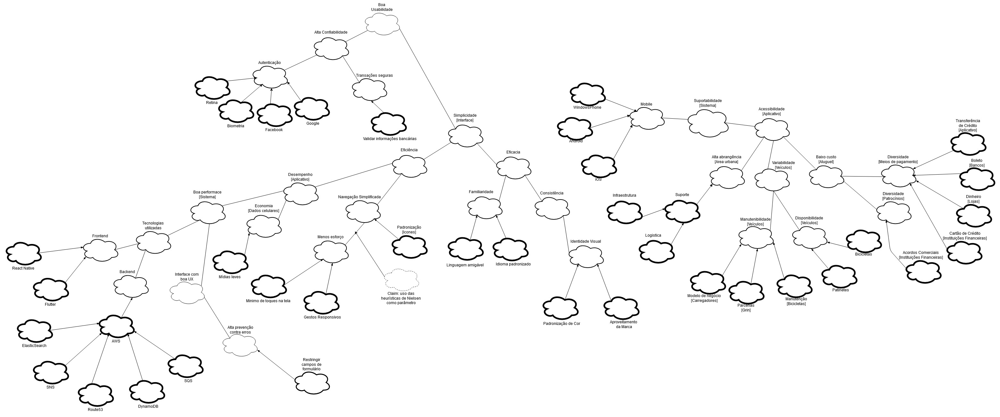
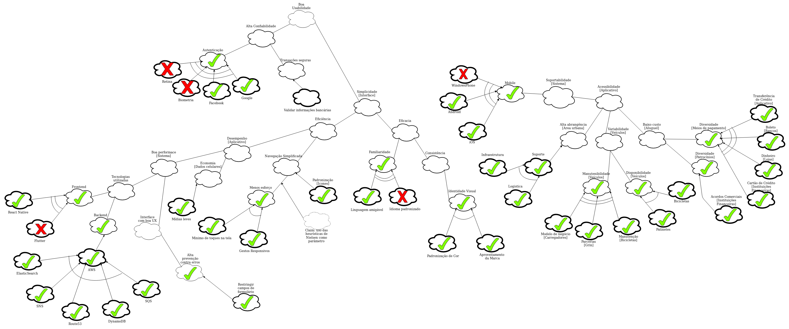

|Versão| Nome | O que fez |  Quando |
|------|------| --------  |-------- |
|2.0| Dâmaso Júnio | Atualizou o documento. |Data: 29/10/2019|
|2.1| Dâmaso Júnio | Fez a propagação. | Data: 18/11/2019 |

# NFR Framework

# Propagação

**Referências:**

- https://yellow.breezy.hr/
- SERRANO, Maurício; SERRANO, Milene. Requisitos - Aula 17. 1º/2019. 7-28 slides. Material apresentado para a disciplina de Requisitos de Software no curso de Engenharia de Software da UnB, FGA.
